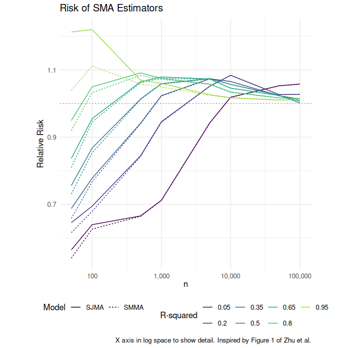
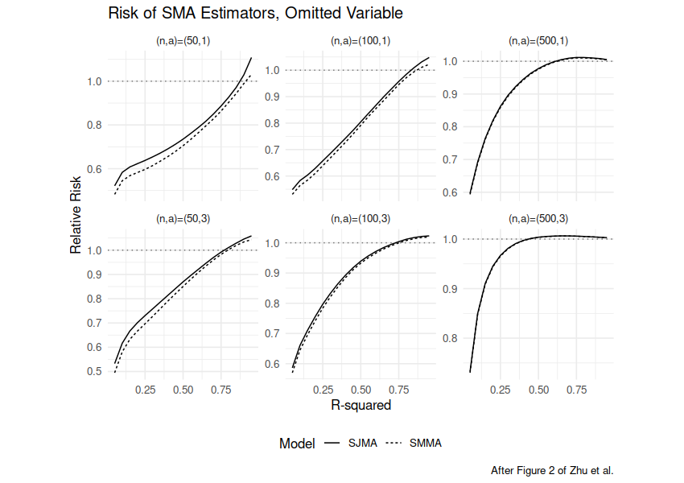
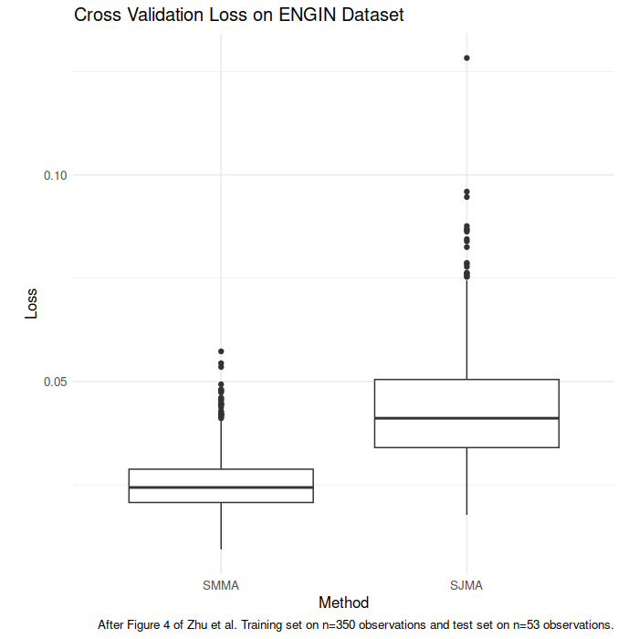

# smak

Scalable Model Averaging Kit.  Implements the [scalable frequentist model averaging](dx.doi.org/10.1080/07350015.2022.2116442)
approach to linear regression of Zhu _et al._, 2022.


-- Steven E. Pav, shabbychef@gmail.com

## Installation

This package may be installed from CRAN; the latest version may be
found on [github](https://www.github.com/shabbychef/smak "smak")
via devtools:


``` r
if (require(devtools)) {
    # latest greatest
    install_github("shabbychef/smak")
}
```

# What is it?

We consider the basic problem of regressing a scalar $y$ against a vector of
independent variables $\vec{x}$. 
There is a long history of practitioners applying some form of _variable selection_ to select
a subset of the vector $\vec{x}$ to use in the regression modeling,
as a way to avoid overfitting and improve generalization to out-of-sample data.
Besides the intractability of testing all $2^p$ subsets of the $p$ variables in $\vec{x}$,
variable selection is often a precursor to questionable statistical practice.

As an alternative to variable selection, Hjort and Claeskens introduced 
[Frequentist Model Averaging](https://www.jstor.org/stable/30045339).
The idea behind FMA is to average together the regression coefficients
built on different subsets of the $\vec{x}$, with weights determined
by one of two methods, Mallows model averaging or Jackknife model averaging.

While FMA supplies a stronger theoretical basis than variable selection,
it does not solve the computational issues.
Enter _Scalable Model Averaging_. 
Under this technique one first computes the singular value decomposition of the
matrix of observed independent variables, $X$.
Then one performs $p$ regressions of the $y$ against each of the left singular values of the $X$,
then performs model averaging on only those $p$ regressions.
Zhu _et al._ show how to do this, and prove that the performance is equivalent
to the computationally intractable version run on all $2^p$ regressions.

## Basic Usage

This package implements scalable model averaging.
The main class of interest is `smam`, a scalable model average model.
One can fit a `smam` object directly via `smamfit` or using the 
formula interface directly via `smam`. Here we illustrate both:


``` r
require(smak)

# create some fake data
nfeat <- 5
nobs <- 100
set.seed(123)
X <- matrix(rnorm(nobs * nfeat), ncol = nfeat)
beta <- rnorm(nfeat)
eta <- X %*% beta
y <- rnorm(length(eta), mean = eta)

# fit directly via smamfit
afit <- smamfit(y, X, method = "mallows")
print(afit)
```

```
## Call: 
## NULL
## 
## Coefficients: 
##   X_1   X_2   X_3   X_4   X_5 
## -0.65 -1.16  1.14  0.62 -1.66
```

Now via the formula interface:


``` r
# same results from data frame
Xdf <- as.data.frame(X)
colnames(Xdf) <- paste0("X_", 1:nfeat)
Xdf$y <- y
bfit <- smam(y ~ -1 + X_1 + X_2 + X_3 + X_4 + X_5,
    Xdf, method = "mallows")
print(bfit)
```

```
## Call: 
## smam(formula = y ~ -1 + X_1 + X_2 + X_3 + X_4 + X_5, data = Xdf, 
##     method = "mallows")
## 
## Coefficients: 
##   X_1   X_2   X_3   X_4   X_5 
## -0.65 -1.16  1.14  0.62 -1.66
```

The model fitting code also accepts (replication) weights.
Note however that the total weight is important, not just the relative weights
of observations.


``` r
Xdf$wts <- runif(nrow(Xdf), min = 1, max = 5)
cfit <- smam(y ~ -1 + X_1 + X_2 + X_3 + X_4 + X_5,
    Xdf, weights = "wts", method = "mallows")
print(cfit)
```

```
## Call: 
## smam(formula = y ~ -1 + X_1 + X_2 + X_3 + X_4 + X_5, data = Xdf, 
##     weights = "wts", method = "mallows")
## 
## Coefficients: 
##   X_1   X_2   X_3   X_4   X_5 
## -0.72 -1.19  1.15  0.69 -1.67
```

You can get the coefficients out, or run predict, either via traditional
methods or via `broom::tidy` and `broom::augment` respectively.
First coefficients:


``` r
print(coef(afit))
```

```
##   X_1   X_2   X_3   X_4   X_5 
## -0.65 -1.16  1.14  0.62 -1.66
```

``` r
require(broom)
print(tidy(afit))
```

```
##   term estimate
## 1  X_1    -0.65
## 2  X_2    -1.16
## 3  X_3     1.14
## 4  X_4     0.62
## 5  X_5    -1.66
```

Now predict:


``` r
newX <- matrix(rnorm(7 * nfeat), ncol = nfeat)
newXdf <- as.data.frame(newX)
colnames(newXdf) <- paste0("X_", 1:nfeat)
print(predict(bfit, newdata = newXdf))
```

```
## [1]  0.36 -0.32  2.09 -0.12 -1.51  0.86 -0.80
```

``` r
print(augment(bfit, newdata = newXdf))
```

```
## # A tibble: 7 × 6
##      X_1     X_2     X_3    X_4    X_5 .fitted
##    <dbl>   <dbl>   <dbl>  <dbl>  <dbl>   <dbl>
## 1 -0.828  1.97    1.01   -1.12  -0.997   0.359
## 2  1.02  -0.0284 -0.518  -1.33  -1.04   -0.316
## 3  0.538 -2.25   -0.294  -0.854 -0.415   2.09 
## 4  0.769  0.0315  0.398  -0.693 -0.239  -0.117
## 5  0.121  0.206  -0.550   0.382  0.484  -1.51 
## 6  0.864 -0.155   0.0913  0.982 -0.321   0.863
## 7  1.38   0.568  -1.96   -0.727 -2.08   -0.799
```


# Confirming Correctness

Besides the unit tests, we attempt to replicate the figures from Zhu _et al._

## Replicating Figure 1

Here we attempt to replicate Figure 1 from example 1 of Zhu _et al._
In those simulations, $X$ is set to consist of correlated columns,
and the $y$ are some linear function of the $X$ plus noise, either
homoskedastic or heteroskedastic. We compute the risk of each model,
defined as mean square difference between the fit mean value of each 
$y_i$ and the actual mean value for that index. As in the paper
we normalize by the risk of the "full model", which is OLS on all the 
columns. We plot the relative risk against the $R^2$ which determines
the amount of noise in the observed $y_i$.

Below in the plot we see similar shapes to the original paper, with
the SMMA and SJMA methods producing very similar results.
However, in contrast to the original paper we see fairly different
shape to the curves for the homoskedastic cases, especially for large
sample size.


``` r
# replicate Example 1 Figure 1 from Zhu et al.
require(smak)
require(mvtnorm)
require(magrittr)
require(dplyr)

# the text spells it 'homoscedastic', etc but
# figure 1 labels are 'Homoskedastic', etc
dosim <- function(nobs, R2, npred = 5, rho = 0.6, nsim = 1000,
    errors = c("Homoskedastic", "Heteroskedastic"),
    randseed = NULL, fixed_theta = FALSE) {
    errors <- match.arg(errors)
    R <- rho^(toeplitz(1:npred) - 1)
    if (!is.null(randseed)) {
        set.seed(randseed)
    }
    if (fixed_theta) {
        # one value for all simulations
        theta <- runif(npred, min = 0, max = 2)
    }
    loss_function <- function(fitted, mu) {
        sum((fitted - mu)^2)
    }
    results <- replicate(nsim, {
        X <- rmvnorm(nobs, sigma = R)
        if (!fixed_theta) {
            # new value for each simulation
            theta <- runif(npred, min = 0, max = 2)
        }
        mu <- X %*% theta
        bit <- mean((mu - mean(mu))^2)
        sigs2 <- bit * ((1/R2) - 1)
        epsi <- switch(errors, Homoskedastic = {
            rnorm(nobs, sd = sqrt(sigs2))
        }, Heteroskedastic = {
            rnorm(nobs, sd = sqrt(ifelse(seq_len(nobs)%%2 >
                0, 3, 1) * sigs2))
        })
        y <- mu + epsi
        est_smma <- smamfit(y, X, method = "mallows",
            return.X = FALSE, return.fitted = TRUE)
        est_sjma <- smamfit(y, X, method = "jackknife",
            return.X = FALSE, return.fitted = TRUE)
        est_full <- lm.fit(X, y)
        # score the losses
        loss_smma <- loss_function(est_smma$fitted.values,
            mu)
        loss_sjma <- loss_function(est_sjma$fitted.values,
            mu)
        loss_full <- loss_function(est_full$fitted.values,
            mu)
        c(smma = loss_smma, sjma = loss_sjma, full = loss_full)
    }) %>%
        t() %>%
        data.frame() %>%
        summarize(SMMA = mean(smma), SJMA = mean(sjma),
            full = mean(full))
}
resu <- tidyr::crossing(tibble(R2 = seq(0.05, 0.95,
    by = 0.05)), tibble(errors = c("Heteroskedastic",
    "Homoskedastic")), tibble(ssize = c(50, 100, 500))) %>%
    group_by(R2, errors, ssize) %>%
    summarize(output = list(dosim(nobs = ssize, R2 = R2,
        errors = errors, nsim = 1000, randseed = 1234))) %>%
    ungroup() %>%
    tidyr::unnest(output)

resu %>%
    mutate(SMMA = SMMA/full, SJMA = SJMA/full) %>%
    select(-full) %>%
    mutate(errors = factor(errors, levels = c("Homoskedastic",
        "Heteroskedastic"))) %>%
    tidyr::gather(key = estimator, value = relative_loss,
        SMMA, SJMA) %>%
    rename(n = ssize) %>%
    ggplot(aes(R2, relative_loss, linetype = estimator)) +
    geom_line() + geom_hline(yintercept = 1, linetype = "dotted",
    alpha = 0.5) + facet_wrap(errors ~ n, labeller = labeller(n = as_labeller(~paste0("n=",
    .x)), errors = label_value, .multi_line = FALSE),
    scales = "free_y") + theme(aspect.ratio = 1) +
    labs(x = "R-squared", y = "Relative Risk", title = "Risk of SMA Estimators",
        linetype = "Model", caption = "After Figure 1 of Zhu et al.")
```

<div class="figure">

<p class="caption">plot of chunk example_1</p>
</div>

### Asymptotically OLS?

Our experiments indicate that for large $n$, the SMA regressions yield the same results as OLS on the same data.
To confirm this we perform the above experiments but for increasing $n$.
Here we see that the _risk_ of both SMA models appears to converge to that of OLS.
Separate simulations would have to be run to establish that the modeled
coefficients converge to those of OLS.


``` r
# repeat the sims, but look at larger n
resu <- tidyr::crossing(tibble(R2 = seq(0.05, 0.95,
    by = 0.15)), tibble(errors = c("Homoskedastic")),
    tibble(ssize = c(50, 100, 500, 1000, 5000, 10000,
        50000, 1e+05))) %>%
    group_by(R2, errors, ssize) %>%
    summarize(output = list(dosim(nobs = ssize, R2 = R2,
        errors = errors, nsim = 500, randseed = 3456))) %>%
    ungroup() %>%
    tidyr::unnest(output)

resu %>%
    mutate(SMMA = SMMA/full, SJMA = SJMA/full) %>%
    select(-full) %>%
    mutate(errors = factor(errors, levels = c("Homoskedastic",
        "Heteroskedastic"))) %>%
    tidyr::gather(key = estimator, value = relative_loss,
        SMMA, SJMA) %>%
    rename(n = ssize) %>%
    ggplot(aes(n, relative_loss, group = interaction(estimator,
        R2, errors), color = factor(R2), linetype = estimator)) +
    geom_line() + geom_hline(yintercept = 1, linetype = "dotted",
    alpha = 0.5) + scale_x_log10(labels = scales::comma) +
    theme(aspect.ratio = 1) + labs(x = expression(n),
    color = "R-squared", y = "Relative Risk", title = "Risk of SMA Estimators",
    linetype = "Model", caption = "X axis in log space to show detail. Inspired by Figure 1 of Zhu et al.")
```

<div class="figure">

<p class="caption">plot of chunk example_1_b</p>
</div>

## Replicating Figure 2

We now consider Example 2 and Figure 2 of Zhu _et al._ That experiment is very
similar, except it includes an omitted variable which drives the expected value
of the $y_i$. Note that the $X$ still has correlated columns, so we get some
information about the omitted variable in the observed $X$.
The relative loss plots here match those in the original paper, though
we see somewhat different shapes of some of the curves.


``` r
# replicate Example 2 Figure 2 from Zhu et al.
require(smak)
require(mvtnorm)
require(magrittr)
require(dplyr)

# the text spells it 'homoscedastic', etc but
# figure 1 labels are 'Homoskedastic', etc
dosim_omit <- function(nobs, R2, missing_coefficient,
    npred = 9, rho = 0.6, nsim = 1000, errors = c("Homoskedastic",
        "Heteroskedastic"), randseed = NULL, fixed_theta = FALSE) {
    errors <- match.arg(errors)
    R <- rho^(toeplitz(1:npred) - 1)
    if (!is.null(randseed)) {
        set.seed(randseed)
    }
    if (fixed_theta) {
        # one value for all simulations
        theta <- runif(npred, min = 0, max = 2)
        theta[npred] <- missing_coefficient
    }
    loss_function <- function(fitted, mu) {
        sum((fitted - mu)^2)
    }
    results <- replicate(nsim, {
        X <- rmvnorm(nobs, sigma = R)
        if (!fixed_theta) {
            # new value for each simulation
            theta <- runif(npred, min = 0, max = 2)
            theta[npred] <- missing_coefficient
        }
        mu <- X %*% theta
        bit <- mean((mu - mean(mu))^2)
        sigs2 <- bit * ((1/R2) - 1)
        epsi <- switch(errors, Homoskedastic = {
            rnorm(nobs, sd = sqrt(sigs2))
        }, Heteroskedastic = {
            rnorm(nobs, sd = sqrt(ifelse(seq_len(nobs)%%2 >
                0, 3, 1) * sigs2))
        })
        model_X <- X[, 1:(npred - 1), drop = FALSE]
        y <- mu + epsi
        est_smma <- smamfit(y, model_X, method = "mallows",
            return.X = FALSE, return.fitted = TRUE)
        est_sjma <- smamfit(y, model_X, method = "jackknife",
            return.X = FALSE, return.fitted = TRUE)
        est_full <- lm.fit(model_X, y)
        # score the losses
        loss_smma <- loss_function(est_smma$fitted.values,
            mu)
        loss_sjma <- loss_function(est_sjma$fitted.values,
            mu)
        loss_full <- loss_function(est_full$fitted.values,
            mu)
        c(smma = loss_smma, sjma = loss_sjma, full = loss_full)
    }) %>%
        t() %>%
        data.frame() %>%
        summarize(SMMA = mean(smma), SJMA = mean(sjma),
            full = mean(full))
}
resu <- tidyr::crossing(tibble(R2 = seq(0.05, 0.95,
    by = 0.05)), tibble(errors = c("Homoskedastic")),
    tibble(missing_coefficient = c(1, 3)), tibble(ssize = c(50,
        100, 500))) %>%
    group_by(R2, errors, missing_coefficient, ssize) %>%
    summarize(output = list(dosim_omit(nobs = ssize,
        R2 = R2, missing_coefficient = missing_coefficient,
        errors = errors, nsim = 1000, randseed = 1234))) %>%
    ungroup() %>%
    tidyr::unnest(output)

resu %>%
    mutate(SMMA = SMMA/full, SJMA = SJMA/full) %>%
    select(-full) %>%
    mutate(errors = factor(errors, levels = c("Homoskedastic",
        "Heteroskedastic"))) %>%
    tidyr::gather(key = estimator, value = relative_loss,
        SMMA, SJMA) %>%
    rename(n = ssize) %>%
    ggplot(aes(R2, relative_loss, linetype = estimator)) +
    geom_line() + geom_hline(yintercept = 1, linetype = "dotted",
    alpha = 0.5) + facet_wrap(~missing_coefficient +
    n, labeller = function(labels) {
    text <- paste0("(n,a)=(", labels$n, ",", labels$missing_coefficient,
        ")")
    list(text)
}, scales = "free_y") + theme(aspect.ratio = 1) + labs(x = "R-squared",
    y = "Relative Risk", title = "Risk of SMA Estimators, Omitted Variable",
    linetype = "Model", caption = "After Figure 2 of Zhu et al.")
```

<div class="figure">

<p class="caption">plot of chunk example_2</p>
</div>

## Replicating Figure 4

We proceed to example 4 of Zhu _et al._ which considers a model for log wages
on the `ENGIN` dataset of Thai engineers. As in the original paper 
we model `lwage ~ male + highgrad + college + grad + polytech + highdrop + educ + swage + exper + pexper + expersq + lswage + pexpersq + mleeduc + mleeduc0 + 1`.
We build the model on 350 rows of the dataset, then test it on the remaining 53 rows.
We compute the mean squared error between the model fit and the actual log wage,
and repeat the experiment 1000 times.
Below we boxplot the mean losses over the 1000 simulations for the two methods.
Contrary to Zhu _et al._ we find that the Jackknife model estimator has
somewhat higher loss in this case than the Mallows model estimator.
Our results on SMMA match the original paper.


``` r
# replicate Example 4 Figure 4 from Zhu et al.
require(smak)
require(mvtnorm)
require(magrittr)
require(dplyr)

dofold <- function(num_test = 100, method = "mallows",
    ...) {
    require(wooldridge, quietly = TRUE)
    require(gtools, quietly = TRUE)
    data(engin)
    n <- nrow(engin)
    permidx <- gtools::permute(seq_len(n))
    test_idx <- permidx[1:num_test]
    train_idx <- permidx[(num_test + 1):n]
    train_df <- engin[train_idx, ]
    amod <- smam(lwage ~ male + highgrad + college +
        grad + polytech + highdrop + educ + swage +
        exper + pexper + expersq + lswage + pexpersq +
        mleeduc + mleeduc0 + 1, data = train_df, method = method,
        ...)
    test_df <- engin[test_idx, ]
    prd <- broom::augment(amod, newdata = test_df) %>%
        mutate(error = .fitted - lwage) %>%
        summarize(loss = mean(error^2)) %>%
        pull(loss)
}
set.seed(1234)
sims <- tibble(method = c("mallows", "jackknife")) %>%
    group_by(method) %>%
    summarize(loss = replicate(1000, dofold(num_test = 403 -
        350, method = method), simplify = TRUE)) %>%
    ungroup()

sims %>%
    mutate(showx = case_when(method == "mallows" ~
        "SMMA", method == "jackknife" ~ "SJMA", TRUE ~
        "ERROR")) %>%
    mutate(showx = factor(showx, levels = c("SMMA",
        "SJMA"))) %>%
    ggplot(aes(showx, loss, group = method)) + geom_boxplot() +
    theme(aspect.ratio = 1) + labs(x = "Method", y = "Loss",
    title = "Cross Validation Loss on ENGIN Dataset",
    caption = "After Figure 4 of Zhu et al. Training set on n=350 observations and test set on n=53 observations.")
```

<div class="figure">

<p class="caption">plot of chunk example_4</p>
</div>
