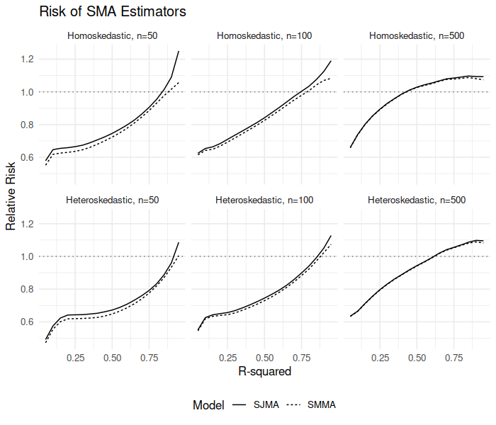

# smak

Scalable Model Averaging Kit.  Implements the [scalable frequentist model averaging](dx.doi.org/10.1080/07350015.2022.2116442)
approach to linear regression of Zhu _et al._, 2022.


-- Steven E. Pav, shabbychef@gmail.com

## Installation

This package may be installed from CRAN; the latest version may be
found on [github](https://www.github.com/shabbychef/smak "smak")
via devtools:


``` r
if (require(devtools)) {
    # latest greatest
    install_github("shabbychef/smak")
}
```

# Basic Usage

## Replicating Figure 1


``` r
# replicate Example 1 Figure 1 from Zhu et al.
require(smak)
require(mvtnorm)
require(magrittr)
require(dplyr)

# the text spells it 'homoscedastic', etc but
# figure 1 labels are 'Homoskedastic', etc
dosim <- function(nobs, R2, npred = 5, rho = 0.6, nsim = 1000,
    errors = c("Homoskedastic", "Heteroskedastic"),
    randseed = NULL, fixed_theta = FALSE) {
    errors <- match.arg(errors)
    R <- rho^(toeplitz(1:npred) - 1)
    if (!is.null(randseed)) {
        set.seed(randseed)
    }
    if (fixed_theta) {
        # one value for all simulations
        theta <- runif(npred, min = 0, max = 2)
    }
    loss_function <- function(fitted, mu) {
        sum((fitted - mu)^2)
    }
    results <- replicate(nsim, {
        X <- rmvnorm(nobs, sigma = R)
        if (!fixed_theta) {
            # new value for each simulation
            theta <- runif(npred, min = 0, max = 2)
        }
        mu <- X %*% theta
        bit <- mean((mu - mean(mu))^2)
        sigs2 <- bit * ((1/R2) - 1)
        epsi <- switch(errors, Homoskedastic = {
            rnorm(nobs, sd = sqrt(sigs2))
        }, Heteroskedastic = {
            rnorm(nobs, sd = sqrt(ifelse(seq_len(nobs)%%2 >
                0, 3, 1) * sigs2))
        })
        y <- mu + epsi
        est_smma <- smamfit(y, X, method = "mallows",
            return.X = FALSE, return.fitted = TRUE)
        est_sjma <- smamfit(y, X, method = "jackknife",
            return.X = FALSE, return.fitted = TRUE)
        est_full <- lm.fit(X, y)
        # score the losses
        loss_smma <- loss_function(est_smma$fitted.values,
            mu)
        loss_sjma <- loss_function(est_sjma$fitted.values,
            mu)
        loss_full <- loss_function(est_full$fitted.values,
            mu)
        c(smma = loss_smma, sjma = loss_sjma, full = loss_full)
    }) %>%
        t() %>%
        data.frame() %>%
        summarize(SMMA = mean(smma), SJMA = mean(sjma),
            full = mean(full))
}
resu <- tidyr::crossing(tibble(R2 = seq(0.05, 0.95,
    by = 0.05)), tibble(errors = c("Heteroskedastic",
    "Homoskedastic")), tibble(ssize = c(50, 100, 500))) %>%
    group_by(R2, errors, ssize) %>%
    summarize(output = list(dosim(nobs = ssize, R2 = R2,
        errors = errors, nsim = 1000, randseed = 1234))) %>%
    ungroup() %>%
    tidyr::unnest(output)

resu %>%
    mutate(SMMA = SMMA/full, SJMA = SJMA/full) %>%
    select(-full) %>%
    mutate(errors = factor(errors, levels = c("Homoskedastic",
        "Heteroskedastic"))) %>%
    tidyr::gather(key = estimator, value = relative_loss,
        SMMA, SJMA) %>%
    rename(n = ssize) %>%
    ggplot(aes(R2, relative_loss, linetype = estimator)) +
    geom_line() + geom_hline(yintercept = 1, linetype = "dotted",
    alpha = 0.5) + facet_wrap(errors ~ n, labeller = labeller(n = as_labeller(~paste0("n=",
    .x)), errors = label_value, .multi_line = FALSE)) +
    labs(x = "R-squared", y = "Relative Risk", title = "Risk of SMA Estimators",
        linetype = "Model")
```

<div class="figure">

<p class="caption">plot of chunk example_1</p>
</div>

